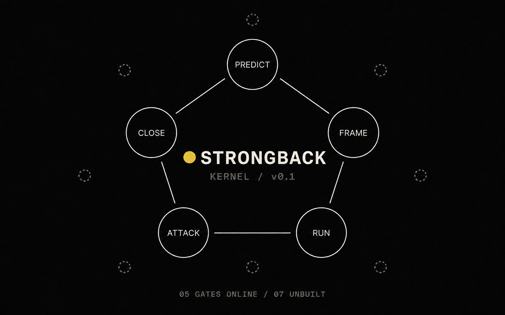

# STRONGBACK

**You are the model. Build the strongback.**

STRONGBACK is a one-file protocol for complex, deferrable work with an AI model.
It makes the model stop the session at five gates: frame the task, commit an
expectation, run a second structure when it matters, attack the result, and
close with a logged decision.

A strongback is an external member that keeps a structure true under load.
Here, the structure is the operator's judgment.

It does not make you know more. It makes your thinking survive contact with
the model, and lets you borrow the model's breadth without inheriting its
errors. The price is latency. Use it for work where a better decision is
worth the extra stops.

## Install — 90 seconds

1. Copy [`STRONGBACK.md`](STRONGBACK.md).
2. Paste it where your model reads standing instructions:
   - **Claude** — a Project's instructions
   - **ChatGPT** — upload it as a Project source, then add a Project instruction
     to follow it
   - **Cursor** — a rules file
   - **anything else** — the system prompt
3. Give it one task that matters. On the first deep task, it should stop at FRAME.

No new app, no build. It degrades to paper: if a model will not enforce a
gate, run that gate by hand. The loop is the system; the file is its carrier.
On instruction-only hosts, enforcement is behavioral rather than a hard
policy boundary.

## Where state lives

A model running only in a hosted chat cannot see this repository or write to
your files. Keep the templates in [`state/`](state/) locally, in a private
fork, or anywhere else durable. When a gate says "log the row," you write it.
When a task needs its history, you paste the relevant file into the session.
Files are the source of truth; your head — and the chat window — are caches.

## The five gates

| Gate | Rule | What it kills |
|---|---|---|
| **FRAME** | Confirm the task, success criterion, and stop condition; use full FRAME when risk or ambiguity requires it. | Fluent work on the wrong problem. |
| **PREDICT** | Commit a falsifiable expectation before seeing the result. Use confidence only when it calibrates something real. | Retrofitting "I knew that" after the answer. |
| **RUN** | Use a second structure when the result depends on framing, decomposition, constraints, order of decisions, or method. Skipping is your call, never the model's. | Shipping your first framing as the answer. |
| **ATTACK** | Check the result against a named error the original process could have missed. | A mirror that nods. |
| **CLOSE** | Close on the written stop condition, or revise that condition before continuing. Log the decision. | Snap-closed and stuck-open, both. |

One page per gate in [`protocols/`](protocols/): the rule, the failure
pattern, and the test that catches it. The canonical failure registry is
[`docs/ENGINE.md`](docs/ENGINE.md) §3.

## Scope and trade

Latency for quality. The loop pays minutes to buy correctness, so it runs on
deferrable, complexity-bound work and switches off for real-time. Live argument,
instant reply: STRONGBACK off, work bare. The scope line is part of the protocol,
not a caveat.

## Evidence posture

This repo does not yet contain outcome evidence that STRONGBACK improves decisions.
It ships the protocol, the logs, and the tests needed to watch that claim become
true or false. [`state/predictions.log`](state/predictions.log) starts empty.
Predictions are logged before outcomes. Misses stay.

## The Map

The five-gate kernel is the complete loop; v0.1 ships all of it. The seven
faint nodes are organs planned around the loop — candidates: state hygiene,
delegation limits, integrity monitoring — not additional gates, and not in
this release.

## Layout

| Path | What it is |
|---|---|
| [`STRONGBACK.md`](STRONGBACK.md) | The kernel. The only file you install. |
| [`protocols/`](protocols/) | One page per gate. |
| [`state/`](state/) | Externalized memory you keep: task cards, logs, prohibitions, model-of-me. Prediction log starts empty. |
| [`evals/`](evals/) | The weekly transfer test (cold-domain and bare runs) and the failure-pattern checklist. |
| [`docs/ENGINE.md`](docs/ENGINE.md) | Working hypothesis, failure registry, who it serves, open questions. |

## Forks

Forking is the distribution model, not a fallback. Strip it, rewrite it, rebrand it
for your stack. Files spread by being copied; if a fork of this becomes the standard,
the protocol won. What cannot be copied is another operator's evidence or practice.

MIT. Copy freely.
